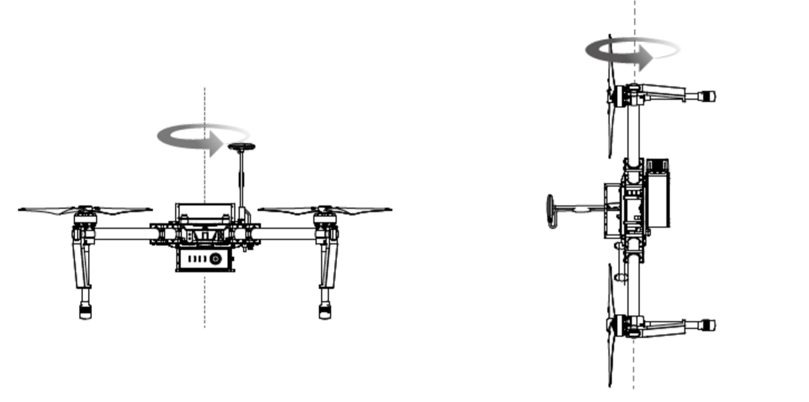

`首次使用，必须进行指南针校准。否则系统可能无法正常工作，从而影响飞行安全。指南针容易受其它电子设备干扰，而导致数据异常影响飞行，甚至导致飞行事故。经常校准可以使指南针工作在最佳状态。`

##警告：
1. 请勿在强磁场区域校准，如磁矿、停车场、带有地下钢筋的建筑区域等。
1. 校准时请勿随身携带铁磁物质，如钥匙、手机等。
1. 请勿在大块金属附近校准。
1. 请勿在室内校准指南针。

##校准步骤:
请选择空阔场地，根据下面的步骤校准指南针。

1. 进入DJI Pilot App“相机”界面，点击上方的飞行器状态提示栏，选择“指南针校准”。飞行器状态指示灯黄灯常亮代表指南针校准程序启动。
2. 水平旋转飞行器360°，飞行器状态指示灯绿灯常亮。
3. 使飞行器机头朝下，水平旋转360°。
4. 完成校准。若飞行器状态指示灯显示红灯闪烁，表示校准失败，请重新校准指南针。



```
注意：
若校准完成后，飞行器状态指示灯仍显示红黄交替闪烁，则表示受到干扰，请更换校准场地。
提示：
飞行器起飞前若需要进行指南针校准，DJI Pilot App 界面上将会出现指南针校准的提示，成功校准后该提示将会消失。
```

##需要重新校准的情况
1. 指南针数据异常，飞行器状态指示灯显示红黄灯交替闪烁。
2. 飞行场地与上一次指南针校准的场地相距较远。
3. 飞行器机械结构有变化。
4. 飞行时漂移比较严重，或者不能直线飞行。
