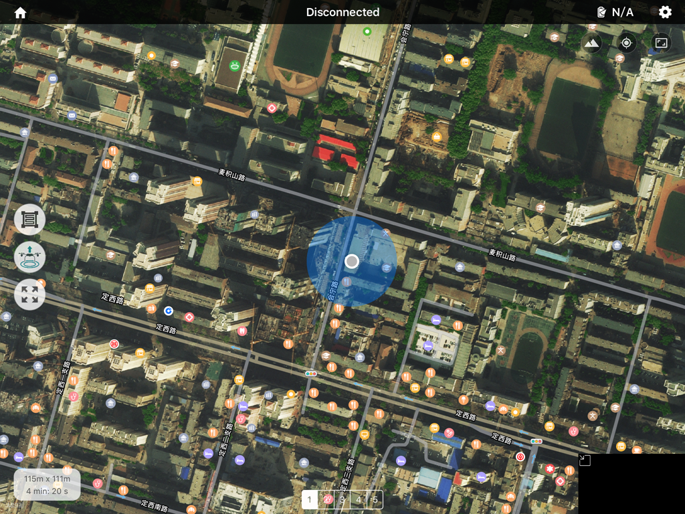
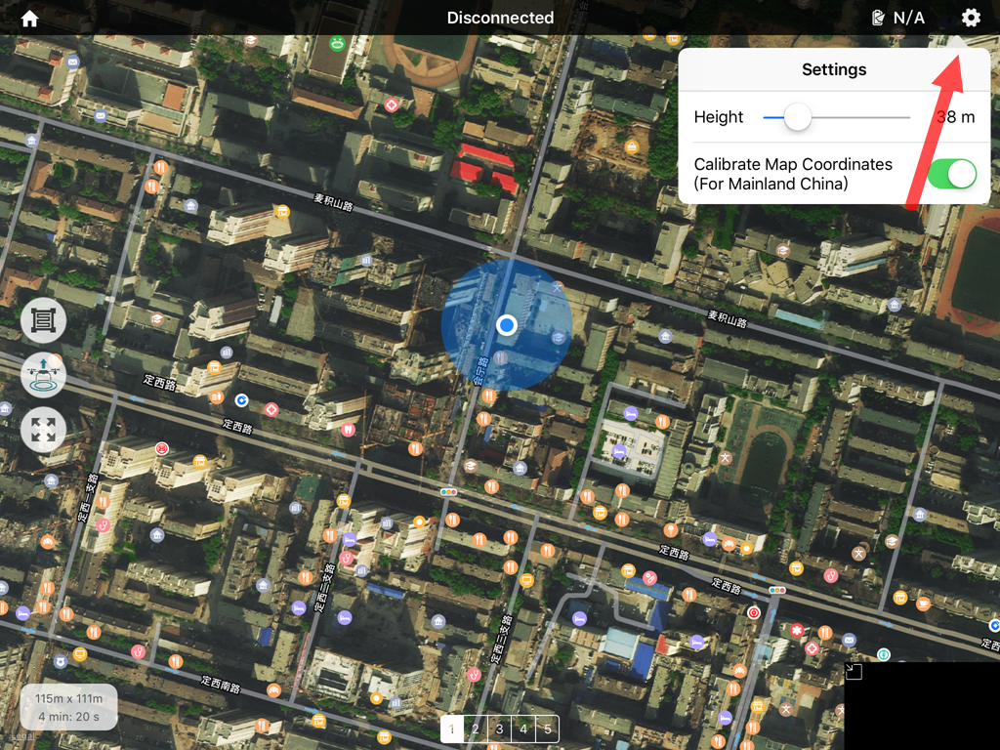
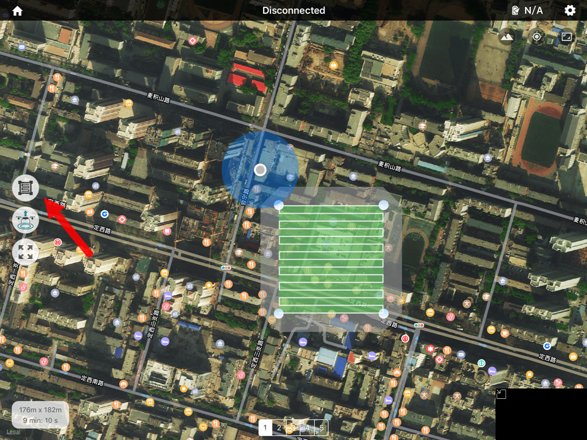
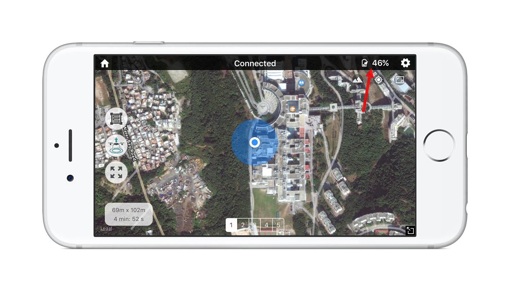

##使用DJI无人机结合Altizure进行快速3D建模

##安装Altizure App
Altizure官方分别提供了iOS和android版本的手机应用下载

请自行到官方商店或者其他商店下载最新版本的App

下面使用iOS APP和iPad，进行图文说明

##支持无人机型号
- DJI Phantom 3 Professional / Advance
- DJI Inspire 1
- DJI Phantom 3 Standard/4K (Beta)
- DJI Inspire 1 Pro/Raw (Beta)
- DJI Phantom 4 (Beta)

##使用流程简介
1.在使用我们的辅助采集应用之前，请先安装相关无人机的最新版固件。

`当前版本已无需安装大疆的开发者固件，只要前往DJI Go将固件升级到最新版本即可。`

2.打开应用前：

1. 启动飞机和遥控器，设定无人机遥控器到 F 档。

1. 确保你的无人机已插入 MicroSD 卡，并且卡中至少还有1GB容量。

1. 在DJI Go里设置好相机曝光。

1. 彻底退出 DJI GO，然后用USB线连接手机和遥控器。

1. 打开Altizure应用。

```
第一次使用Altizure应用时，请确保有稳定的网络连接。

根据我们的使用经验，手机或者平板需要在有网络的环境下链接

如果是精通拍照的专业人士，可以自行选择曝光。

如果不确定曝光程度可以设置自动曝光(auto)
```
3.点击屏幕下方的 Mission Start 按键会进入数据采集功能。 

此时界面上方会有提示遥控器是否连接。若显示 Connected，则意味着遥控器成功连接到我们的应用。
若显示Disconnected 或者 Connection Failed 则意味着遥控器没有连接到我们的应用，请检查遥控器与手机的USB线连接是否牢固并尝试重启应用。 

若成功连接，地图上的白色飞行器图标代表飞行器。蓝色圆圈代表操作者（手机）当前的位置。


4.进入主界面后可以点击右上角的齿轮按钮选取飞行高度（默认高度为100m）。


5.点击左侧上方的按钮放置采集区域。绿色区域为图像采集区域。拖动四个角上的蓝色方块可以调整区域大小，拖动绿色区域可以移动图像采集区域。前请调整图像采集区域，使其覆盖你想要采集的区域。


6.可以点击左侧下方的按钮切换到旋转拍摄区域的模式，这时你便可拖动四个角上的蓝色方块调整区域旋转角度。


7.右下角会显示该次飞行任务覆盖区域的大小和预计每条航线的完成时间。


8.在地图下方有1～5五个数字。每个数字对​​应这个区域的一个拍摄角度，一共有五个角度：俯拍和与竖直方向成30度的四个方向斜拍。
你可以通过点击数字来选择本次飞行想要拍摄的角度。在起飞之前请确认将遥控器上的模式开关拨至F档位。在点击应用界面左侧的飞行器起飞图标之后应用开始自动上传任务。
在上传任务结束后，飞行器会自动起飞进行数据采集。若上传任务成功后，飞机没有自动进行数据采集，请检查遥控器的模式开关是否拨至F档位。起飞后无法更改图像采集区域，请确认选取了正确的区域后再按下起飞按钮。


9.当飞机处于两个长段路径点之间时会触发自动拍照机制。此时右下角的图像预览窗口会有闪烁。

10.当结束一段任务后，飞机将会自动返航降落。此时你可以查看电池电量来决定是否更换电池再开始下一段飞行。你也可以在飞到一半时按下遥控器上的自动返航按钮返航。注意：路径点不会被保存，下次开始相同任务时飞机会从头开始而非从中断点继续飞行


##Support
案例探索，请访问[altizure](https://www.altizure.com)

更多帮助，请访问[altizure/support](https://www.altizure.com/support)